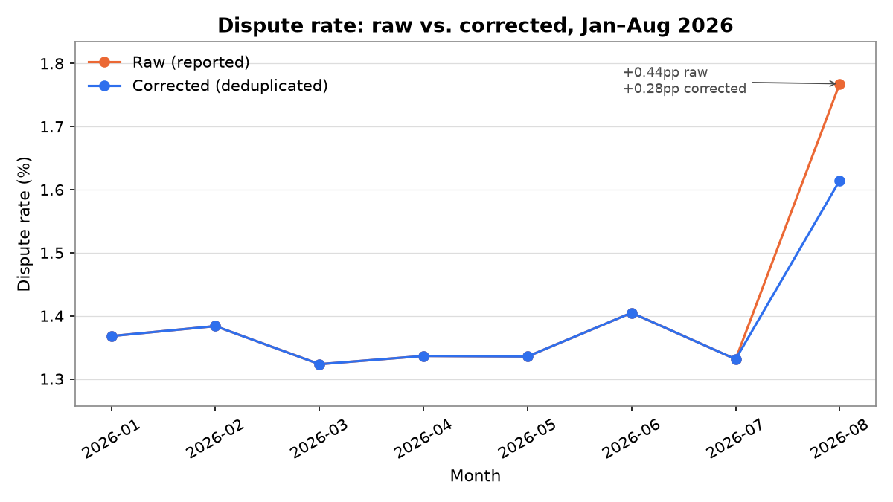
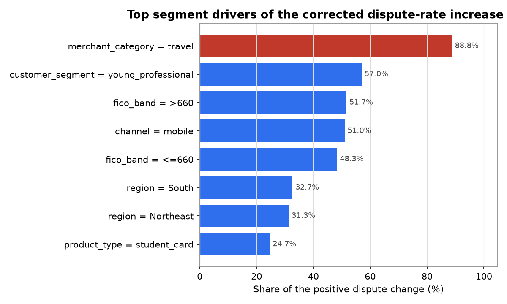
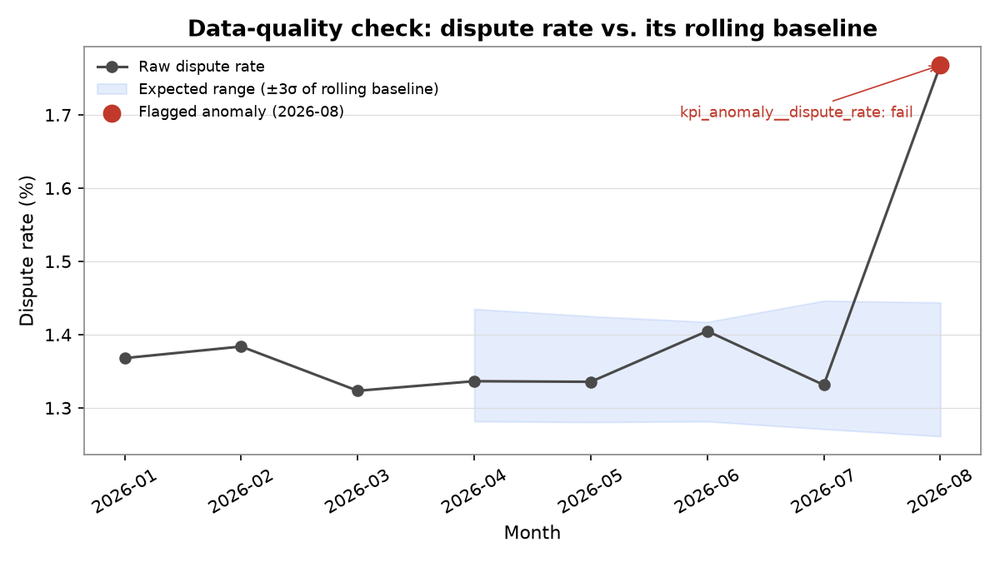
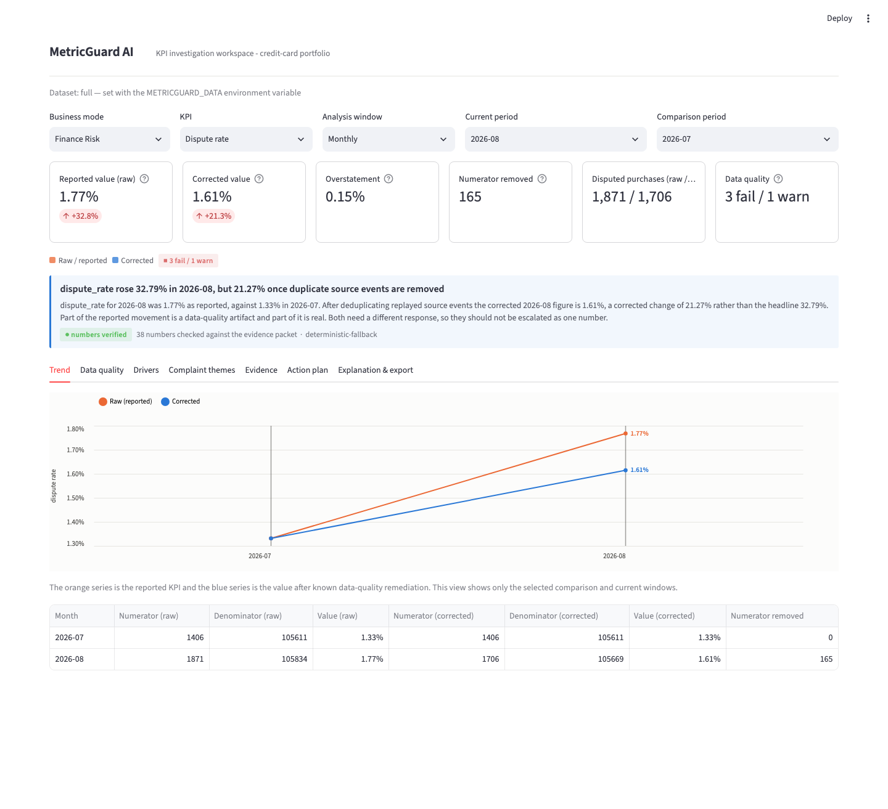

# MetricGuard AI

**KPI monitoring and root-cause analytics for a credit card portfolio.**
Validate the data → measure what really moved → explain why → recommend what to do.


---

## The headline

August's dispute rate at a fictional card issuer looked like a **+32.8%** month-over-month spike.

About a third of that spike was not real. A replayed dispute-platform batch had duplicated 165 disputed travel purchases. After deduplication, the true increase was **+21.3%**, concentrated in **travel merchants on the mobile channel**.

Reporting the raw number would have sent a risk team chasing a partly imaginary problem. MetricGuard catches the data issue first, then explains what remains.

| | July 2026 | August 2026 | Change |
|---|---|---|---|
| Raw dispute rate | 1.3313% | 1.7679% | **+32.79%** |
| Corrected dispute rate | 1.3313% | 1.6145% | **+21.27%** |



---

## Why this project exists

When a KPI moves, an analyst is asked one question: *why?* Answering it well means answering three questions in order.

1. **Can we trust the data?** 31 automated checks for duplicates, completeness, referential integrity, and statistical drift.
2. **Did the metric really move?** Every KPI is computed twice, raw and deduplicated, so the data-quality component and the real component are both visible.
3. **What drove it, and what should we do?** Segment and interaction attribution, complaint-theme analysis, and a prioritized action plan where every claim is linked to evidence.

---

## What it found

| Result | Value |
|---|---|
| Duplicate disputed purchase rows detected and removed | 165 |
| Top driver of the corrected increase | `merchant_category = travel` (88.8% of the change) |
| Strongest interaction | `travel × mobile` |
| Data quality checks | 25 pass · 1 warn · 5 fail (of 31) |
| Narrative validation | 38 of 38 numbers traced to evidence, 0 unsupported |
| SQL vs. pandas parity | 7 of 7 checks match exactly |



The anomaly check scores each month against its own trailing baseline, so the month being tested never contributes to the baseline it is judged against.



---

## How it works

```
generate_synthetic_data.py   fictional card issuer: accounts, transactions, snapshots, complaints

quality_checks.py      →  can we trust the data?      31 checks: duplicates, completeness, integrity, drift
metric_engine.py       →  did the KPI really move?    6 KPIs, computed raw and corrected
driver_analysis.py     →  what segment drove it?      count/rate attribution, interactions, decision tree
text_theme_analysis.py →  what do customers say?      complaint narratives mapped to a business taxonomy
action_engine.py       →  what should we do?          prioritized, evidence-linked actions with guardrails
explanation_engine.py  →  manager-ready narrative     deterministic by default; every number verified
sql_engine.py + sql/   →  the same KPIs in DuckDB     proven identical to the pandas path

run_pipeline.py        →  one command, one data load, 18 result files
app/streamlit_app.py   →  seven-tab dashboard over all of the above
```

### The SQL layer

The KPI definitions also exist as DuckDB SQL, and a parity script proves the two engines agree to the decimal.

| File | Contents |
|---|---|
| `sql/01_clean_views.sql` | Deduplicated transaction views using `ROW_NUMBER() OVER (PARTITION BY ...)` |
| `sql/02_kpis.sql` | Monthly dispute, fraud-claim, and payment-failure rates |
| `sql/03_segments.sql` | Dispute rate by merchant category, channel, and their interaction |

### The explanation layer

The narrative runs deterministically by default, with no API key and no network call. Every figure it states is checked against the evidence packet before it is shown, so the explanation cannot drift from the data. An LLM path is available when `OPENAI_API_KEY` is set, under the same verification.



---

## Quickstart

```bash
make setup      # creates a virtual environment (finds a Python 3.11+ interpreter)
make pipeline   # runs every stage, prints the headline numbers, writes outputs/
make app        # opens the Streamlit dashboard
make test       # full test suite
```

The repository ships with a 5.4 MB demo dataset, so everything runs immediately after cloning. `make data` regenerates the full 929,838-row dataset locally; `METRICGUARD_DATA=full|sample` chooses which one to use, and both the pipeline and the dashboard display which dataset is loaded.

---

## The data

Fully synthetic and deterministic (fixed seed, byte-identical on regeneration). No real institution, customer, or transaction is involved, and merchant names are fictional.

| | Full | Demo (committed) |
|---|---|---|
| Accounts | 12,000 | 2,200 |
| Transactions | 929,838 | ~172,000 |
| Complaints | 5,300 | ~3,100 |
| Period | Jan–Aug 2026 | Jan–Aug 2026 |

Two data defects are planted deliberately, and documented in `docs/ground_truth.md` so a reader can confirm the pipeline finds what was hidden:

- A replayed dispute-platform batch duplicates 65% of disputed August travel/mobile purchases.
- A card-processor batch drops `merchant_category` on 18% of purchases during a three-day July window.

---

## Repository layout

```
src/        pipeline modules, config, SQL engine, parity check
sql/        DuckDB metric definitions
app/        Streamlit dashboard
tests/      pytest suite (fast tests run in CI; full-data tests marked slow)
docs/       methodology, data dictionary, KPI research, ground truth
data/       committed demo data; full data generated locally
reports/    figures
```

**Stack:** Python 3.13 · pandas · DuckDB · scikit-learn · Streamlit · Altair · Matplotlib · pyarrow · pytest · ruff · GitHub Actions
Optional and opt-in: sentence-transformers (local cache only), OpenAI API.

---

## Engineering notes

**A null that changes shape between file formats.** The planted "missing merchant category" defect arrives as `NaN` through CSV but as an empty string through Parquet, because Parquet preserves exactly what was written. Any check using `.isna()` alone therefore behaved differently on the full and demo datasets. Auditing every null check in the codebase surfaced four occurrences, one of which was actively corrupting the demo dataset's driver tables.

**A KPI whose denominator lives in another table.** The generic segment-attribution code assumes a metric's numerator and denominator come from the same row. That holds for every KPI here except the complaint rate, which was silently dividing complaint counts by complaint counts and reporting 1.0 for every segment. It now has a dedicated path and an explicit definition: complaints per 1,000 active accounts, restricted to account-level segments.

**A check that disagrees between dataset sizes, left alone on purpose.** One row-count anomaly check fails on the demo data and passes on the full data. Loosening the threshold until both agreed would have hidden the reason: a fixed z-score threshold behaves differently on samples of different sizes. The behavior is documented rather than tuned away.

---

## Limitations and next steps

- Synthetic data. The defects are planted, so detection rates are not evidence of real-world performance.
- Complaint theming uses embedding similarity against a fixed taxonomy, not a trained classifier.
- Five data quality checks fail by design, to demonstrate what a failing check looks like.
- Next: alert thresholds tuned per KPI, a dbt-style test layer on the SQL views, and backtesting the anomaly rules against more months.

## License

MIT
